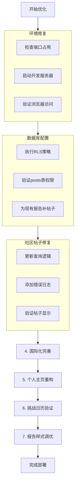

# Tennis Journey 产品优化计划

## 项目状态分析

基于对项目代码和对话记录的全面分析，以下是当前系统状态：

### ✅ 已完成的功能
1. **用户认证系统** - 注册/登录流程完善
2. **网球档案填写** - 必填+选填字段完整
3. **7天挑战日历** - 支持历史天数编辑和点击跳转
4. **球探报告生成** - 已集成 DeepSeek API，Edge Function 功能完整
5. **支付系统** - Stripe 集成 + 国内激活码
6. **个人主页** - 档案展示、报告列表
7. **社区广场** - 帖子查询框架就绪
8. **多语言框架** - 中/英/繁支持

### 🔴 需要优化的问题

#### 1. 开发服务器访问问题（已诊断）
- **状态**: `npm run dev` 正常启动，Vite 服务器在 `http://localhost:5173` 上运行
- **问题**: 浏览器无法访问
- **可能原因**: 防火墙、浏览器缓存、网络配置
- **建议**: 检查浏览器控制台错误，尝试 `--host` 参数或使用其他端口

#### 2. 社区广场无帖子
- **根本原因**: Edge Function 已包含帖子创建逻辑，但需要验证：
  - `posts` 表 RLS 策略是否已应用（`posts_rls_allow_read.sql`）
  - 现有报告是否缺少关联的帖子
  - 查询逻辑是否正确加载 `profiles.username`

#### 3. 首页国际化不完整
- **现状**: 导航和页脚已国际化，但部分静态内容仍为硬编码中文
- **涉及文件**: `src/App.jsx` 中的模拟数据、统计卡片等
- **解决方案**: 将所有硬编码文本移至 `i18n.js` 翻译字典

#### 4. 个人主页编辑功能优化
- **现状**: 昵称有独立编辑按钮，个人签名无编辑入口
- **目标**: 统一在右上角"编辑档案"按钮，点击进入 Onboarding 页面编辑
- **需要修改**:
  - `Profile.jsx`: 移除独立编辑UI，保留只读展示
  - `Onboarding.jsx`: 添加用户名和个人签名字段

#### 5. 7天挑战日历逻辑验证
- **现状**: 日历解锁逻辑正确，但需要确认最终提交流程
- **问题点**: 用户完成7天打卡后是否显示"最终提交"按钮
- **验证**: `Challenge.jsx` 第185行 `handleFinalSubmit` 函数和状态流转

#### 6. 球探报告样式优化
- **现状**: 已使用 `ScoutReportNew.jsx` 分页滑动式设计
- **需要验证**: 效果是否满足网易云音乐年度报告体验
- **优化方向**: 确保8个页面完整，交互流畅

## 详细执行计划

### 阶段一：基础设施修复（优先级：高）

| 任务 | 说明 | 文件/工具 |
|------|------|-----------|
| 1.1 验证服务器访问 | 检查防火墙，尝试 `vite --host` | 命令行 |
| 1.2 执行RLS策略 | 运行 `posts_rls_allow_read.sql` | Supabase Dashboard |
| 1.3 部署Edge Function | 确保最新版本已部署 | `supabase functions deploy` |

### 阶段二：核心功能修复（优先级：高）

| 任务 | 说明 | 文件/工具 |
|------|------|-----------|
| 2.1 社区帖子查询优化 | 完善 `Community.jsx` 错误处理 | `src/pages/Community.jsx` |
| 2.2 为现有报告创建帖子 | 运行 `verify_and_create_post.js` | Node.js 脚本 |
| 2.3 验证帖子显示 | 检查社区页面数据流 | 浏览器测试 |

### 阶段三：用户体验优化（优先级：中）

| 任务 | 说明 | 文件/工具 |
|------|------|-----------|
| 3.1 首页国际化完善 | 翻译剩余硬编码文本 | `src/App.jsx`, `src/lib/i18n.js` |
| 3.2 个人主页编辑重构 | 移除独立编辑，统一入口 | `src/pages/Profile.jsx` |
| 3.3 Onboarding页面增强 | 添加用户名和签名字段 | `src/pages/Onboarding.jsx` |

### 阶段四：功能验证（优先级：中）

| 任务 | 说明 | 文件/工具 |
|------|------|-----------|
| 4.1 7天挑战流程测试 | 验证最终提交按钮逻辑 | `src/pages/Challenge.jsx` |
| 4.2 报告样式验证 | 确认分页滑动效果 | `src/pages/ScoutReportNew.jsx` |
| 4.3 完整用户旅程测试 | 注册→档案→挑战→报告→社区 | 端到端测试 |

## 风险评估与缓解

### 技术风险
1. **数据库RLS策略冲突**: 可能影响现有数据访问
   - **缓解**: 在测试环境中先验证，备份现有策略
2. **Edge Function 部署失败**: API密钥或配置问题
   - **缓解**: 检查环境变量，使用日志调试

### 业务风险
1. **用户数据影响**: 修改编辑流程可能影响用户体验
   - **缓解**: 保持向后兼容，提供清晰的用户指引

## 所需确认事项

在开始实施前，需要您确认：

1. **数据库操作权限**: 是否允许在Supabase执行SQL脚本？
2. **部署策略**: 是否需要在部署前进行完整测试？
3. **用户体验变更**: 个人主页编辑流程变更是否接受？

## 后续步骤建议

1. **立即执行**: 修复服务器访问问题，确保开发环境正常
2. **快速验证**: 测试社区帖子显示，确认核心社交功能
3. **迭代优化**: 按优先级逐步完善其他功能

---

## 决策点

请您审阅此计划并提供反馈：

1. 是否同意按此优先级顺序执行？
2. 对于数据库修改（RLS策略）是否需要特别批准？
3. 是否需要进行完整的端到端测试后再部署？

**建议行动**: 如果计划获得批准，我将切换到 Code 模式开始实施。